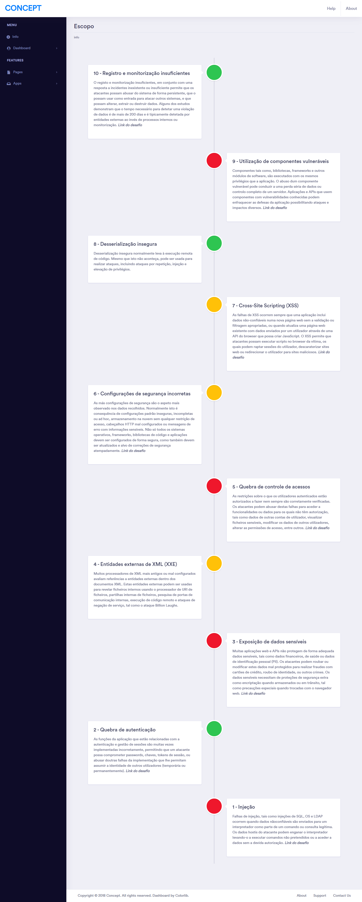

# concept
##### http://vps17257.publiccloud.com.br/concept-master/
## Resolução para os desafios
### A0 - [Registro e monitorização insuficientes](http://vps17257.publiccloud.com.br/concept-master/pages/login.php)
Para resolver esse desafio você precisa executar um ataque de força bruta com o mesmo usuário, apartir de n requisições é retornado a flag.
### A9 - [Utilização de componentes vulneráveis](http://vps17257.publiccloud.com.br/concept-master/user-info.php)
Para resolver esse desafio você precisa fazer uma requisição do tipo POST com o valor "token" para a chave "cmd".
### A7 - [Cross-Site Scripting (XSS)](http://vps17257.publiccloud.com.br/concept-master/influencer-finder.php)
Para resolver esse desafio você precisa identificar o campo vulnerável que não está sendo filtrado, o que acaba levando para outra url que é indexada no botão "Send Messages" "http://vps17257.publiccloud.com.br/concept-master/dashboard-influencer.php?profile=" que recebe como argumento um nome que é refletido na página, caso você passe como argumento o  é retornado a flag.
### A6 - [Configurações de segurança incorretas](http://vps17257.publiccloud.com.br/concept-master/)
Para resolver esse desafio você precisa olhar o arquivo robots.txt no root do site, lá tem o local para o arquivo com o token.
### A5 - [Quebra de controle de acessos](http://vps17257.publiccloud.com.br/concept-master/pages/login.php)
Para resolver esse desafio você precisa explorar o SQL Injection, uma vez autenticado você terá acesso ao token na barra de notificações.
### A3 - [Exposição de dados sensíveis](http://vps17257.publiccloud.com.br/concept-master/influencer-profile.php)
Para resolver esse desafio você precisa ver o código fonte da página.
### A2 - [Quebra de autenticação](http://vps17257.publiccloud.com.br/concept-master/pages/inbox.php)
Para resolver esse desafio você precisa desativar o javascript, porque ele redirecicona para outra página.
### A1 - [Injeção](http://vps17257.publiccloud.com.br/concept-master/pages/message-chat.php)
Para resolver esse desafio você precisa alterar a consulta SQL, explorando assim SQL injection para que retorne mais informações do que aparece na tela.

